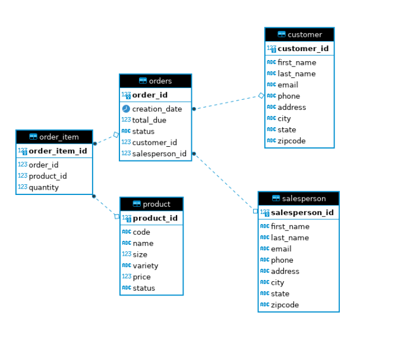

# Introduction
This app demonstrates the JDBC workflow in a maven project. It connects to a containerized 
PostgreSQL database, executes some statements,processes the results and closes the connection. 

# ER Diagram
The image below is an entity relationship diagram showing the relationships amongst the tables.

## Design Patterns
### Data Access Objects (DAO)
DAO's (Data Access Objects) are one of the most common patterns when dealing with databases.
They provide an abstraction layer between the raw JDBC code and the business logic. They are useful
because they allow us to have a single instance of the database and to compute the joins using the
foreign keys. It separates the application/business layer from the persistence layer using an 
abstract API reducing coupling between business logic and persistence logic.

The DAO design pattern involves the use of more complex queries to collect and transform data in 
remote data sources. DAOs will typically work with multiple related DTOs and defer joins and other 
functions to the Database. Because of this deferral, a DAO will typically need fewer statements and 
connections to do its job. 

### Repository
The Repository pattern involves using simple queries to collect and transform data in remote data 
sources. Unlike the DAO pattern, it focuses on single-table access per class - working with only a 
single DTO. Repositories will typically perform any Joins or other data transformations for 
themselves, rather than requesting them from the DB. Due to these two properties of Repositories, 
they are better suited to distributed systems in which DAOs struggle. This pattern is usually used 
for horizontal scaling of apps. 

