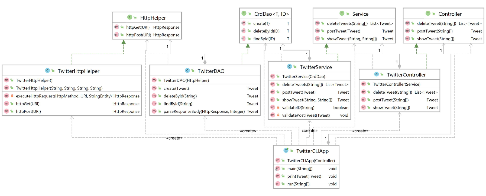

# Introduction
The Twitter app allows users to post | show | delete Twitter posts using the command line interface 
with the help of Twitter REST API. It utilizes common java libraries such as HTTP, JSON, OAuth, I/O) 
and an MVC architecture. In addition, this project introduced essential software design pattern
such as TDD and JUnit/Mockito were used for testing. The Spring framework was used to handle 
dependency injections and docker was used for app deployment.

# Quick Start
Clone the repository by pulling the image from docker:
```bash
#pull the docker image
docker pull annelln/twitter   
```
After cloning this repository to your system, navigate to its root directory (.../twitter), 
set the environment variables. The keys/secrets is obtained from your twitter developer account.
```bash
# set environment variables using terminal
export consumerKey="consumerKey goes here"
export consumerSecret="consumerSecret goes here"
export accessToken="accessToken goes here"
export tokenSecret="tokenSecret goes here"
```
Then execute the following command to clean maven:
```bash
mvn clean package
```
This command should generate a .jar file that the Docker container will use to run the application. 
If the project was built successfully, you will find in the /twitter/target/ directory a file called
`twitter-1.0-SNAPSHOT.jar`.

```bash
#run the app on docker and post a tweet
docker run --rm \
-e consumerKey=your_consumerKeyHere \
-e consumerSecret=your_consumerSecretHere \
-e accessToken=your_accessTokenHere \
-e tokenSecret=your_tokenSecretHere \
annelln/twitter post "tweet text" "latitude:longitude"

Sample JSON output:
{
  "created_at" : "Fri Mar 26 17:32:16 +0000 2021",
  "id" : 1276568976764686343,
  "id_str" : "1276568976764686343",
  "text" : "tweet text",
  "entities" : {
    "hashtags" : [ ],
    "user_mentions" : [ ]
  },
  "coordinates" : {
    "coordinates" : [ 12.0, -12.0 ],
    "type" : "Point"
  },
  "retweet_count" : 0,
  "favorite_count" : 0,
  "favorited" : false,
  "retweeted" : false
}
```
You replace "latitude" and "longitude" with the numerical values of your geographical location.

These commands can also be run in place of the above if the JAR files are created properly as follows:
```bash
java -jar [.jar file] post "text" "latitude:longitude"
java -jar [.jar file] show "tweet_id" [field1, field2, ...]
java -jar [.jar file] delete [id1, id2, ...]

```
# Implementations

# Design

As seen from the above UML diagram, the classes are modularized to model-view-controller architecture. 
We do not implement the "view" component as the outputs are received in the command line. The classes
are modularized to perform it's dedicated functionality and allows it to be decoupled for freedom 
from chaining dependencies. The TwitterCLIApp is the main class that calls the controller methods. 
The controller calls the service layer. The service layer calls the DAO which in turn calls the 
http helper to access the twitter REST API. 

## Spring
### TwitterCLIApp (Application layer/ App Main)
The TwitterCLIApp uses the Spring framework for dependency management and leverages Maven to 
automatically install dependencies/artifacts when loaded. There were three different approaches to 
implementing the Spring framework for this application: TwitterCLIBean, TwitterCLIComponentScan, and
TwitterCLISpringBoot. For this project, springboot was used for dependency injections since it's 
widely used.

### Controller 
The Controller layer processes user input (arguments from CLI) and calls the corresponding service 
layer. It parses the text such as post|show|delete and it's corresponding string id(s), geo objects, 
field options and further calls the service layer to validate the fields.

### Service
The Service layer handles the business logic of the application, essentially it validates the input 
fields. It responds with the corresponding error messages if the input fields do not match the 
required logic. For example, it will return an error if the tweet ID passed in is not a string that 
contains only numbers. This information exchange between the Controller and Service layer is done via
Data Transfer Objects (DTOs).

### TwitterDAO
The MVC TwitterDAO layer is responsible for persisting data into the appropriate data source (in 
this case, the Twitter REST API). It leverages HTTPClient library to interact with the REST API. It 
generates the URI needed to feed the HTTPClient objects, and process the response returned into DAOs.

### HttpHelper
The HTTPHelper executes the `GET/POST` requests as well as assigns the keys and tokens for authentication.
It is added as a dependency for the DAO to retrieve/send data to the Twitter API.

### Models
The models used in the Twitter CLI App is the Tweet Model, implemented as POJOS. The 5 classes 
used to construct the tweet object can be found under the model's folder. The classes are as follows:
- Coordinates
- Entities
- Hashtag
- Tweet
- UserMention
 
A sample of the simplified JSON Tweet object:
```JSON
{
   "created_at":"Mon Feb 18 21:24:39 +0000 2019",
   "id":1097607853932564480,
   "id_str":"1097607853932564480",
   "text":"test with loc223",
   "entities":{
      "hashtags":[
         {
            "text":"documentation",
            "indices":[
               211,
               225
            ]
         },
         {
            "text":"parsingJSON",
            "indices":[
               226,
               238
            ]
         },
         {
            "text":"GeoTagged",
            "indices":[
               239,
               249
            ]
         }
      ],
      "user_mentions":[
         {
            "name":"Twitter API",
            "indices":[
               4,
               15
            ],
            "screen_name":"twitterapi",
            "id":6253282,
            "id_str":"6253282"
         }
      ]
   },
   "coordinates":{
      "coordinates":[
         -75.14310264,
         40.05701649
      ],
      "type":"Point"
   },
   "retweet_count":0,
   "favorite_count":0,
   "favorited":false,
   "retweeted":false
}
```

# Improvement
- Improve the user interface by creating a "view" component to allow the user to access the data in 
    a more readable format than JSON.
  
- Provide more user functions to interact with the tweets. For example, allow them to filter tweets 
with specific hashtags and collect them all at once.

- Include the update function to allow user to update an existing tweet.

  
