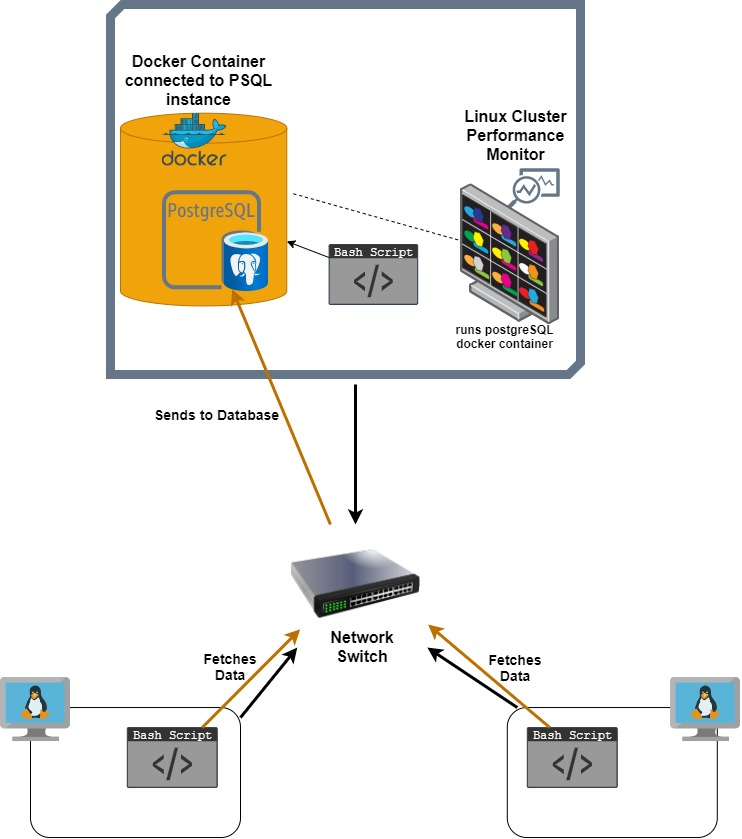

# Linux Cluster Monitoring Agent 😎
A monitoring agent that helps you keep track of your machines' hardware resource usage and allocation in real-time.


## Introduction
This project automates the process of monitoring servers/nodes of linux that are connected through a switch and communicates internally through IPv4 addresses. This simplifies the jobs of infrastructure managers, sys admins or even site reliability engineers who wants to monitor hardware specifications of servers/nodes and resource usages (e.g number of CPU, free memory, cache, etc). Allowing for comparison of current asset to future asset needs based on the information gathered to make informed decisions for enterprise planning. 

The linux cluster monitoring agent (LCMA) is powered by [docker](https://docs.docker.com/) containers under the hood to provision a postgreSQL (psql) database instance to collect information from the host machines. The project contains a bash script that automatically configures the creation of the psql container using docker and two other bash scripts that are installed on the servers as monitoring agents to retrieve relative data about host usage and host information. The data retrieved will then populate the psql database table running in the container.

Note: I use clusters/servers/nodes interchangeably. 

## Quick Start
```
- Start a psql instance using psql_docker.sh
./scripts/psql_docker.sh create db_username db_password

- Create tables using ddl.sql
psql -h localhost -U postgres -d host_agent -f sql/ddl.sql

- Insert hardware specs data into the db using host_info.sh
./scripts/host_info.sh psql_host psql_port db_name psql_user psql_password
e.g ./scripts/host_info.sh localhost 5432 host_agent postgres password

- Insert hardware usage data into the db using host_usage.sh
./scripts/host_usage.sh psql_host psql_port db_name psql_user psql_password
e.g ./scripts/host_usage.sh localhost 5432 host_agent postgres password

- Crontab setup to automate the collection of the usage statistics every minute
- edit cronjobs
crontab -e 

- add this line to crontab, the usage data will be collected every minute (indicated by * * * * *)
* * * * * bash <your path>/host_agent/scripts/host_usage.sh localhost 5432 host_agent postgres password > /tmp/host_usage.log

- list crontab jobs
crontab -l
```

## Implementations
1. A [PostgreSQL](https://www.postgresql.org/) instance is used to persist all the data. The server hosting the database needs the following script:
  - [psql_docker.sh](./scripts/psql_docker.sh) acts as a switch to start/stop the psql instance.
  - Go to the project directory to run the command to start the postgreSQL container:
  ```bash 
     # creates a psql docker container with the given username and password
     ./scripts/psql_docker.sh create db_username db_pasword
     
     # start the psql docker container
     ./scripts/psql_docker.sh start
     
     # stop the psql docker container
     ./scripts/psql_docker.sh stop
  ```

2. The host agent database consist of two tables `host_info` and `host_usage`. They can be found inside this script:
  - [ddl.sql](./sql/ddl.sql) creates the two tables that holds host_info and host_usage data. Usage as follows:
  ```bash 
     # The above docker instance needs to be running first 
     # Execute ddl.sql script on the host_agent database against the psql instance
     psql -h localhost -U postgres -d host_agent -f sql/ddl.sql 
  ```

3. The bash scripts to gather server usage data, which then insert into the psql instance. The agent will be installed on every server/node. The agent consists of two bash scripts:

  - [host_info.sh](./scripts/host_info.sh) collects the host hardware info and insert it into the database. It will be run only once at the installation time.
  ```bash
     ./scripts/host_info.sh psql_host psql_port db_name psql_user psql_password
  ```
    Set the inputs as follows:
  * `psql_host`: IP address that the PostgreSQL instance is running on (ran localhost for testing)
  * `psql_port`: port number of the PostgreSQL instance; default port is 5432
  * `db_name`: host_agent
  * `psql_user`: postgres
  * `psql_password`: enter desired login password to the PostgreSQL instance

  - [host_usage.sh](./scripts/host_usage.sh) collects the host usage (CPU and Memory) and inserts into the database. It will be triggered by the crontab job every minute.
  ```bash
     ./scripts/host_usage.sh psql_host psql_port db_name psql_user psql_password
  ```  
  Implement `crontab` to allow the script to run every minute to insert a new entry into the database. Use following crontab commands:
  ``` 
    - edit cronjobs
    bash crontab -e
    - add this to the VIM editor when it opens up to allow the script to run every minute
    * * * * * bash <your path>/host_usage.sh localhost 5432 host_agent postgres password > /tmp/host_usage.log
  ```
  To exit the vim editor press `Esc` key and type `:wq:` and press enter to return back to terminal.
  
4. [queries.sql](./sql/queries.sql) contains some queries that help the linux cluster administrator to monitor the cluster better for future resource planning. 
  ```bash
    # Execute ddl.sql script on the host_agent database against the psql instance
    psql -h localhost -U postgres -d host_agent -f sql/queries.sql
  ```
  * The first query groups hosts by their hardware information such as their cpu_number and sorted by their memory size in descending order within each cpu_number group. This helps the administrator see the cluster's memory distribution in the linux host machines.
  * The second query calculates the average used memory in percentage over 5 mins interval for each host. (used memory = total memory - free memory).
  * The third query captures the host failures which are detected if the data points collected between a 5-min interval is less than three. The cron job is supposed to insert a new entry to the host_usage table every minute when the server is healthy. 
   
## Database Modeling
- Database schema of each table 
- The `host_info` table contains information of hardware specifications of the cpu/node
   Field | Description 
   ----- | ----------- 
  id | Unique primary key for the host, auto-incremented
  hostname | Content in the second column
  cpu_number | Number of cpu cores
  cpu_architecture | CPU architecture (x86_64)
  cpu_model | Model of CPU "Intel(R) Xeon(R) CPU @ 2.30GHz" 
  cpu_mhz | Clock speed of the cpu in MHz
  l2_cache |  L2 cache in KB   
  total_mem | Total RAM in MB
  timestamp | The time when the host_info specifications were taken

- The `host_usage` table contains information about individual cpu/node usage
   Field | Description 
   ----- | ----------- 
  timestamp | The time when the host_usage data were taken 
  host_id | Host identifier
  memory_free | Free RAM in MB
  cpu_idle | % of time the CPU is idle
  cpu_kernel | % of time the CPU is running kernel code
  disk_io | Number of disks undergoing I/O processes
  disk_available | Available space in the disk's root directory in MB

## Testing
- The bash script commands were tested by running them line by line on the command line to verify it's function. The entire bash script combined were also tested by running the script to verify the correctness of it's functions by following the steps on [implementations](#Implementations)
- The SQL queries written were tested on the PSQL command line and outputs were checked on the IntelliJ Ultimate database tool.

## Areas of Improvements
- Write more queries to detect several types of system failures from resource usage data and automate it to notify the linux cluster administrator when metrics drop below standard threshold
- Improve the host failure query to automatically detect when the node failed to insert three or more datapoints during a 5-minute interval
- Create a visualization board and populate it with data from the database to monitor server health, long term performance and drive business decisions
