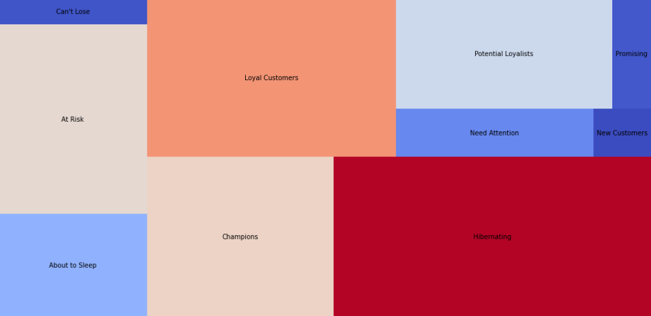

# Introduction
This project solves business questions provided by London Gift Shop (LGS), which is an online store 
that sells gift-ware. Data analytics/visualizations in Python is performed on the data supplied by 
LGS to help them make decisions and improve revenue.

The main tools used in this project are Python, Jupyter Notebook, Pandas Dataframe, and Numpy are 
used for delivering a proof of concept (PoC) in this project. As a junior developer, we were tasked 
with 2 years worth of historical transactional data, to extract data insights and meaningful information
to help develop sales and marketing techniques.

A single data warehouse was built using a single-table PostgreSQL database to host the data received 
from London Gift Shop. The LGS retail data is loaded into a PostgreSQL database which is provisioned 
using a docker container. The python script is written on Jupyter Notebook for real-time visualization 
of plots. Pandas dataframes are used to quickly display tables and manipulate the data in it by
performing functions, filtering and grouping operations. 
  
# Implementation
## Project Architecture
The Jarvis Data Analytics PostgreSQL warehouse is fed information from the Online Transaction Processing
(OLTP) SQL Server Database from the online LGS web application. The retail data is then loaded on 
Jupyter Notebooks to perform data wrangling to create meaningful plots and visualizations. Client's 
personal information such as phone, address, name etc is removed from the database as part of the 
ETL process.

The LGS web application is housed using Microsoft Azure cloud-based solution. As shown on the diagram, 
both front-end and back-end is deployed on Azure Blob and Azure Kubernetes microservices respectively. 
The web pages containing html/css/javascript is managed with Azure Blob storage solution and is 
distributed using its Content Distribution Network (CDN). Transactional operations performed by clients 
through APIs are handled by an Azure Kubernetes Cluster, which then executes the requested transactions 
and updates it on Azure SQL Server.

## Data Analytics and Wrangling
The detailed data analytics performed can be found in this [notebook](./retail_data_analytics_wrangling.ipynb). 

One of the most significant findings on consumer behavior comes from the Recency-Frequency-Magnitude 
(RFM) analysis which breaks down customers into different segments based on the category they fall 
under. The segments separate users from champions to hibernating users for example, and provides 
engagement strategies for marketing team, tailored for each segment. A more detailed overview of 
what each segments' recency and frequency score represent is shown below: 

### The Recency and Frequency Grid breakdown

- Champions [R(4 – 5), F(4 – 5)]
- Loyal Customers [R(3 – 4), F(4 – 5)]
- Potential Loyalists [R(4 – 5), F(2 – 3)]
- Promising [R(3 – 4), F(0 – 1)]
- Can’t Lose Them [R(1 – 2), F(4 – 5)]
- At Risk [R(1 – 2), F(3 – 4)]
- About to Sleep [R(2 – 3), F(1-2)]
- Hibernating [R(1 – 2), F(1 – 2)]
- New Customers R [(4 – 5), F(0 – 1)]
- Need Attention R [(2 – 3), F(2 – 3)]

A frequency recency grid provides a visual summary of LGS's clients sorted by RFM type:

In our evaluation, 3 segments are emphasized: "Can't Lose", "Hibernating" and "Champions".

### Number of customers for segments:

Can't Lose = 71, Hibernating = 1522, Champions = 852

### Can't Lose Segment:

Customers in this segment have not recently made a purchase. For this reason, we need to prepare a
discount and gift campaign for this segment. These customers made a large number of purchases when
they made purchases before. However, recency values are lower than they should be. The campaign to be
implemented for these customers should include both items purchased and recommendations based on
previous activities. New and popular products associated with the products that they were interested
in can also be included in this campaign. Situations that will cause these customers to stop buying
need to be investigated.

- The last shopping date of the customers is on average 353 days before.
- Customers have made an average of 16 purchases.
- Customers spent an average of £ 8356.

### Champions Segment:

Customers in this segment are responsible for most of the revenue. Campaigns should be implemented
to ensure the continuity of the shopping of these customers.

- The last shopping date of the customers is 30 days before average.
- Customers made an average of 19 purchases.
- Customers spent an average of £ 10796.

### Hibernating Segment:

Customers in this segment have not made a purchase for a long time. However, by offering discounts, 
they may be attracted to another purchase.

- The last shopping date of the customers is 481 days before average.
- Customers made an average of 1 purchases.
- Customers spent an average of £ 438.

# Improvements

-  Expand on RFM analysis with a more comprehensive plot including magnitudes
-  Leverage the other RFM segment tags to suggest marketing techniques that reaches a wider range
   of consumers
-  Apply machine learning model to forecast revenue performance 